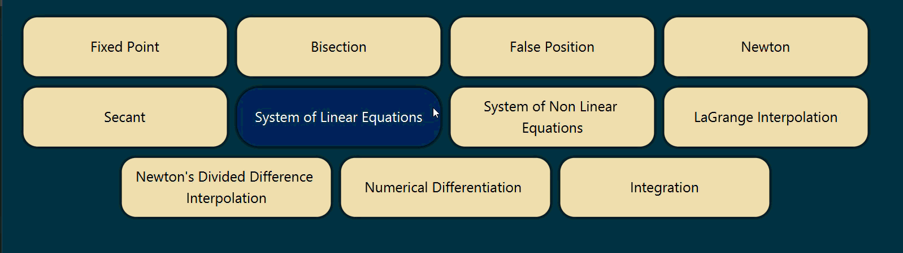

<!-- Improved compatibility of back to top link: See: https://github.com/othneildrew/Best-README-Template/pull/73 -->
<a id="readme-top"></a>

<!-- PROJECT SHIELDS -->
<div align="center">

[![Contributors][contributors-shield]][contributors-url] [![Forks][forks-shield]][forks-url] [![Stargazers][stars-shield]][stars-url] [![Issues][issues-shield]][issues-url] [![LinkedIn][linkedin-shield]][linkedin-url]

</div>

<!-- PROJECT LOGO -->
<br />
<div align="center">
  <h3 align="center">Numerical Analysis Application</h3>

  <p align="center">
    A visual and computational application for exploring and calculating various numerical methods!
    <br />
    <br />
    <a href="https://github.com/AmmarKeon/Numerical-Project/issues">Report Bug</a>
    &middot;
    <a href="https://github.com/AmmarKeon/Numerical-Project/issues">Request Feature</a>
  </p>
</div>

<!-- TABLE OF CONTENTS -->
<details>
  <summary>Table of Contents</summary>
  <ol>
    <li>
      <a href="#about-the-project">About The Project</a>
      <ul>
        <li><a href="#built-with">Built With</a></li>
      </ul>
    </li>
    <li>
      <a href="#getting-started">Getting Started</a>
      <ul>
        <li><a href="#prerequisites">Prerequisites</a></li>
        <li><a href="#installation">Installation</a></li>
      </ul>
    </li>
    <li><a href="#usage--animation">Usage & Animation</a></li>
    <li><a href="#methods-implemented">Methods Implemented</a></li>
    <li><a href="#contributing">Contributing</a></li>
    <li><a href="#contact">Contact</a></li>
  </ol>
</details>

<!-- ABOUT THE PROJECT -->
## About The Project

This project focuses on applying algorithms covered in Numerical Analysis to solve mathematical problems programmatically. It leverages a Java-based backend to execute logic and a GUI built with JavaFX and styled via CSS for usability.

**Important Note:** While there is a GUI, some numerical methods utilize hardcoded/fixed equations or only display their step-by-step processing and outputs directly in the IDE's terminal/console. Make sure to check standard output when evaluating these specific methods.

*In this project I've playing around with JavaFX more specifically animations with CSS or within JavaFX code itself as shown in <a href="#usage--animation">Usage & Animation</a>, at this point i was familiar with JavaFX and comfortable exploring new challenges to enhance the visual experience.*

<p align="right">(<a href="#readme-top">back to top</a>)</p>

### Built With

<div align="center">

[![Java][Java.com]][Java-url] [![JavaFX][JavaFX.com]][JavaFX-url] [![CSS][CSS.com]][CSS-url]

</div>

<p align="right">(<a href="#readme-top">back to top</a>)</p>

<!-- GETTING STARTED -->
## Getting Started

To get a local copy up and running follow these simple example steps.

### Prerequisites

* Java Development Kit (JDK) 8 or higher
* JavaFX SDK (if not included in your JDK)
* An IDE like IntelliJ IDEA, Eclipse, or VS Code

### Installation

1. Clone the repo
   ```sh
   git clone https://github.com/AmmarKeon/Numerical-Project.git
   ```
2. Open the project in your IDE.
3. Configure the JavaFX SDK path in your module settings or build configurations if needed.
4. Run the main class of the application.

*Note if you wish to use Maven or Gradle to setup JavaFX, use https://openjfx.io/openjfx-docs/ and head to your preferable tool setup guide.*

<p align="right">(<a href="#readme-top">back to top</a>)</p>

<!-- USAGE EXAMPLES -->
## Usage & Animation

Here is a showcase of how the buttons animations i've created look, this started as just a test at first and then i realized i can create anything my imagination can think of, with enough dedication that is.

The Hover animation is a standalone method can be called anywhere in the codebase to activate for any JavaFX object/element.
*(Animation speed is hardcoded, if you wish to use this animation with different speeds i can modify the function to work on a user-specified speeds, <a href="#contact">Contact Me</a>)*



<p align="right">(<a href="#readme-top">back to top</a>)</p>

<!-- METHODS IMPLEMENTED -->
## Methods Implemented

The application currently integrates a wide range of numerical methods grouped as follows:

* **Root-Finding Algorithms:** Bisection, False Position, Fixed Point Iteration, Secant, Newton-Raphson, and Halley's Method.
* **Systems of Non-Linear Equations:** Custom solvers included.
* **Interpolation & Curve Fitting:** Newton's Divided Difference, Lagrange Interpolation, and Least Squares Curve Fitting.
* **Numerical Differentiation & Integration:** Trapezoidal Rule, Simpson's Rules, Romberg Integration, and Gauss Quadrature.
* **Differential Equations:** Euler's Method, Modified Euler's Method.

*(Remember to check the terminal for outputs on certain methods)*

<p align="right">(<a href="#readme-top">back to top</a>)</p>

<!-- CONTRIBUTING -->
## Contributing

You can fork the project and add features/adjust code to what your heart desires.

1. Fork the Project
2. Create your Feature Branch (`git checkout -b feature/NewFeature`)
3. Commit your Changes (`git commit -m 'Add some NewFeature'`)
4. Push to the Branch (`git push origin feature/NewFeature`)
5. Open a Pull Request

<p align="right">(<a href="#readme-top">back to top</a>)</p>

<!-- CONTACT -->
## Contact

Ammar - [Github Profile](https://github.com/AmmarKeon) - ammarkeon@gmail.com

Project Link: [https://github.com/AmmarKeon/Numerical-Project](https://github.com/AmmarKeon/Numerical-Project)

<p align="right">(<a href="#readme-top">back to top</a>)</p>


<!-- MARKDOWN LINKS & IMAGES -->
[contributors-shield]: https://img.shields.io/github/contributors/AmmarKeon/Numerical-Project.svg?style=for-the-badge
[contributors-url]: https://github.com/AmmarKeon/Numerical-Project/graphs/contributors
[forks-shield]: https://img.shields.io/github/forks/AmmarKeon/Numerical-Project.svg?style=for-the-badge
[forks-url]: https://github.com/AmmarKeon/Numerical-Project/network/members
[stars-shield]: https://img.shields.io/github/stars/AmmarKeon/Numerical-Project.svg?style=for-the-badge
[stars-url]: https://github.com/AmmarKeon/Numerical-Project/stargazers
[issues-shield]: https://img.shields.io/github/issues/AmmarKeon/Numerical-Project.svg?style=for-the-badge
[issues-url]: https://github.com/AmmarKeon/Numerical-Project/issues
[linkedin-shield]: https://img.shields.io/badge/-LinkedIn-black.svg?style=for-the-badge&logo=linkedin&colorB=555
[linkedin-url]: https://www.linkedin.com/in/ammarkeon/
[Java.com]: https://img.shields.io/badge/Java-ED8B00?style=for-the-badge&logo=openjdk&logoColor=white
[Java-url]: https://www.java.com/
[JavaFX.com]: https://img.shields.io/badge/JavaFX-FF0000?style=for-the-badge&logo=java&logoColor=white
[JavaFX-url]: https://openjfx.io/
[CSS.com]: https://img.shields.io/badge/CSS-1572B6?style=for-the-badge&logo=css3&logoColor=white
[CSS-url]: https://developer.mozilla.org/en-US/docs/Web/CSS
